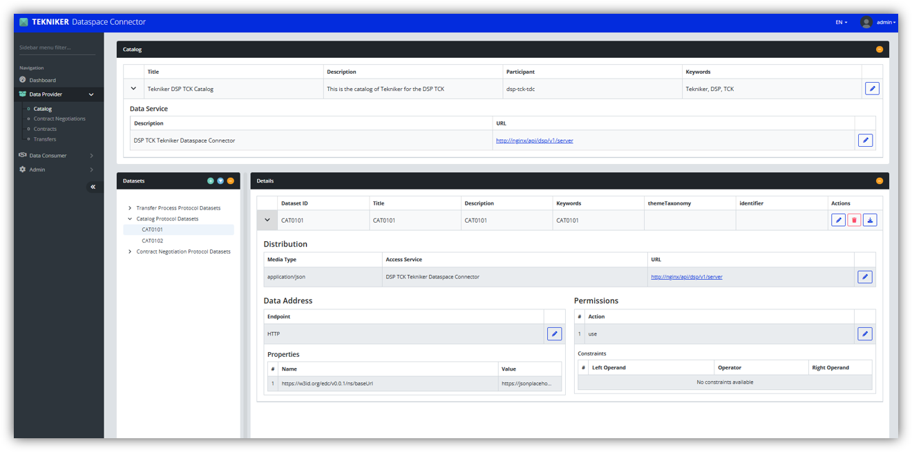
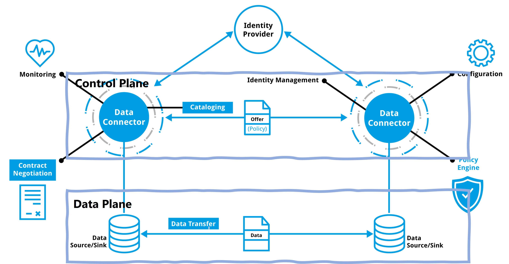
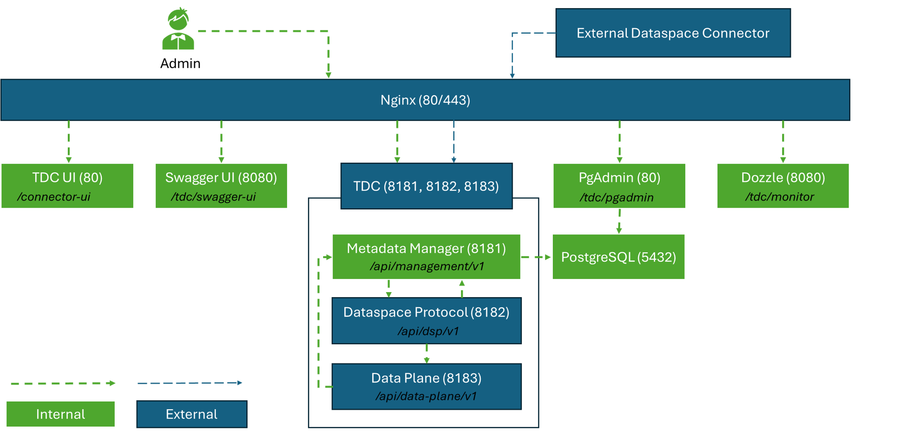

<h1>Tekniker Dataspace Connector</h3>



# Table of contents
1. [📋 Introduction](#introduction)
2. [📦 Project Structure](#project-structure)
3. [🔧 Requirements](#requirements)
4. [🧱 Architecture](#architecture)
5. [🧩 Compliance](#compliance)
6. [🚀 Deployment](#deployment)
7. [📃 License](#license) 
8. [🛠️ Support](#support)


# 1. 📋 Introduction <a name="introduction"></a>

The **Tekniker Dataspace Connector (TDC)**, acting as a **Participant Agent** as defined in the **[DSSC Blueprint 2.0](https://dssc.eu/space/BVE2/1071251457/)**,  is a reference tool, published in the **[DSSC Toolbox](https://toolbox.dssc.eu/)** and the **[IDSA Data Space Connector Report](https://internationaldataspaces.org/idsa-data-space-connector-report/)**, designed to enable companies to efficiently operate within data spaces. 

Built in accordance with European standards such as the Dataspace Protocol (DSP), it adopts a two-fold approach to ensure data spaces three main pilars, while providing flexibility and scalability. These pillars are:

1. **[Interoperability](#interoperability)**
2. **[Trust](#trust)**
3. **[Data Sovereignty](#soverignty)**

In particular, addressing real operational challenges, the connector offers core functionalities to:

- **Publish and discover** large volumes of **Datasets** using expressive vocabularies. 
- **Negotiate usage Agreements** both manually and automatically. 
- **Transfer** diverse types of **Datasets** from multiple data sources. 

The TDC also includes a user-friendly interface designed for non-technical users to easily manage offered and requested datasets, requested contract negotiations, resulting policies, and ongoing data transfers without deep technical knowledge. This usability is a key aspect for promoting the adoption of data spaces fostering open, collaborative, and trusted ecosystems.

## 1.1. Interoperability <a name="interoperability"></a>
 
The TDC ensures seamless data sharing following a two-fold approach. As represented in the figure below, the TDC is divided into the **Control Plane** and **Data Plane**. 

<div align="center">
  
</div>
<br/>

- **Control Plane**: it manages data transfers by providing the interfaces to publish a Catalog of Datasets, negotiate usage Agreements and access Agreed Datasets. To this end, it implements the  **[Dataspace Protocol 2025-1](https://eclipse-dataspace-protocol-base.github.io/DataspaceProtocol/2025-1/)**, which consists of three diferent protocols:

  - **Catalog Protocol**: it is a set of protocols and schemas to publish a Catalog of Datasets following the widely accepted [Data Vocabulary Catalog (DCAT)](https://www.w3.org/TR/vocab-dcat-3/).
  - **Contract Negotiation Protocol**: it is a set of protocols and schemas to negotiate usage Agreements for specific Datasets within a Catalog.
  - **Transfer Process Protocol**: it is a set of protocols and schemas to access agreed Datasets.

- **Data Plane**: it transfers data from/to different **HTTP APIs** and considering the following Data Types: **Text Plain, JSON, XML, Binary, PDF.**

## 1.2. Trust <a name="trust"></a>

The TDC grants trusted data transactions by supporting the following two **Federated Identity Management** approaches:

- **Centralized Identities**: a central entity in the role of the Identity Provider issues, holds and manages identities. Following this approach, the following standards are supported:
    - **[OpenID Connect](https://auth0.com/docs/authenticate/protocols/openid-connect-protocol)**: built on top of the **OAuth 2.0**, it allows Dataspace Connectors to verify the identity of a target Dataspace Connector and to obtain basic user profile information based on **JSON web tokens (JWTs)**, which can obtained using flows conforming to the OAuth 2.0 specifications. 
- **Decentralized Identities**: a central entity in the role of the Identity Provider issues identities and the Dataspace Connector holds and self-manages them. Following this approach, the followig standards  are supported:  
  - **[Decentralized Claims Protocol](https://projects.eclipse.org/projects/technology.dataspace-dcp)**: it is a set of protocols and schemas based on OpenID4VC to issue and present identities based on **[Verifiable Credentials v2.0](https://www.w3.org/TR/vc-data-model-2.0/)** and **[Decentralized Identifiers v1.0](https://www.w3.org/TR/did-core/)** W3C Specifications. 

## 1.3. Data Sovereignty <a name="soverignty"></a>

The TDC ensures data sovereignty through the implementation of a Policy Engine, which enforces agreed usage policies for specific Datasets during data sharing through the corresponding Data Planes.

# 2. 📦 Project Structure <a name="project-structure"></a>

This repository includes all the files needed to deploy the TDC with Docker:

- `nginx/`: Reverse proxy configuration.
- `pictures/`: Illustrative TDC diagrams.
- `docker-compose.yml`: Orchestration file for Docker containers.
- `tdc.env`: Environment variables file.
- `tck/`: DSP TCK configuration and results.
- `README.md`: This documentation.

# 3. 🔧 Requirements <a name="requirements"></a>

To deploy the TDC make sure your system has the following software installed:

| Software        | Version      | Check Command                 |
|-----------------|--------------|-------------------------------|
| **Git**         | ≥ 2.43.0     | `git --version`               |
| **Docker**      | ≥ 28.0.1     | `docker --version`            |

# 4. 🧱 Architecture <a name="architecture"></a>

The following diagram illustrates the architecture of the TDC and all the Docker containers involved in its deployment:



## 🧩 Component Descriptions

  - **Nginx:** Reverse proxy that routes external HTTP/HTTPS traffic to internal services, except for PostgreSQL, which remains inaccessible externally.
  - **TDC UI:** Web-based user tool for administrators to interact with and manage the TDC.
  - **Swagger UI:** Web-based developer tool for testing and exploring the TDC’s REST APIs.
  - **TDC:** Main services responsible for offering and requesting Datasets within a data space, compliant with the Dataspace Protocol.
    - **Metadata Manager:** Manages metadata related to available Datasets.
    - **Dataspace Protocol:** Handles Catalogs, Contract Negotiations, and Transfer Processes
    - **Data Plane:** Transfers data from/to data sources (HTTP APIs) in different formats (text/plain, application/json, application/xml, application/octet-stream and application/pdf) following a PULL and PUSH approach (HTTP APIs).
  - **PostgreSQL:** Relational database used by the TDC to manage dataset metadata.
  - **PgAdmin:** Web-based developer tool for monitoring and managing the PostgreSQL database.
  - **Dozzle:** Web-based developer tool to monitor in real-time all running Docker containers.

## 5. 🧩 Compliance <a name="compliance"></a>

The **TDC** has successfully passed validation for the following protocols:

 - **5.1 Dataspace Protocol**

 ### 5.1 Dataspace Protocol

- **Version Tested:** [DSP 2025-1](https://eclipse-dataspace-protocol-base.github.io/DataspaceProtocol/2025-1/)
- **Validation Mechanism:** [DSP TCK 1.0.0-RC5](https://github.com/eclipse-dataspacetck/dsp-tck/releases/tag/v1.0.0-RC5)
- **Validation Status:** ✅ Passed 65/65 tests
- **Configuration:** `/tck/2025-1/configuration/`  
- **Results:** `/tck/2025-1/logs/`  

As a result, the TDC correctly implements the DSP requirements defined by the **Eclipse Dataspace Working Group**, guaranteeing compliance and interoperability with other compliant connectors.

# 6. 🚀 Deployment <a name="deployment"></a>

This section explains how to configure and deploy the TDC using Docker. It is divided into the following parts:

  - **6.1 🐳 Docker Images:** Where to find and how to pull the Docker images used in the deployment.
  - **6.2 🔧 Configuration:** Files and parameters that need to be customized before deploying.
  - **6.3 🚀 Deployment Steps:** Commands to start the Docker containers.
  - **6.4 🌐 Accessing Services:** Paths to each service available after deployment.

## 6.1  🐳 Docker Images

Most of the Docker images used in the deployment are publicly available and will be automatically downloaded when running `docker compose`, but not all of them.

For clarity and reproducibility, the specific versions of the public and privates images used are listed below:

### Public Images

| Image | Version |
|-------|---------|
| `nginx` | `1.29.0` |
| `swaggerapi/swagger-ui` | `v5.28.1` |
| `dpage/pgadmin4` | `9.7.0` |
| `amir20/dozzle` | `v8.13.11` |

### Private Images

The following images are hosted in Tekniker’s private Azure Docker registry and require authentication:

| Image | Version |
|-------|---------|
| `dockerhubsii.azurecr.io/tekniker-dataspace-connector` | `1.2.3` |
| `dockerhubsii.azurecr.io/tekniker-dataspace-connector-postgresql` | `1.1.0` |
| `dockerhubsii.azurecr.io/tekniker-dataspace-connector-ui` | `1.2.2` |


To access these private images, execute the following command:

```bash
docker login -u dockerhubsiiuser -p <PASSWORD_PROVIDED_UPON_REQUEST> dockerhubsii.azurecr.io
```

Contact [Gonzalo Gil](mailto:ggil@tekniker.es) for the password.

### 💡 TIP

If your virtual machine requires `sudo` to execute `docker compose` commands, make sure to also run the `docker login` command with `sudo`.

Failing to do so may result in an **Unauthorized** error when pulling images from a registry.

## 6.2 🔧 Configuration

This section describes the main configuration steps for deploying the TDC environment. 

---
### 1️⃣ TLS

To enable TLS, perform the following steps:

1. Create a folder named `/certs` to store the certificate and key files.

2. Place your certificate and key files on PEM and KEY format into the `/certs` folder.

3. Uncomment and update the following lines in your `docker-compose.yml` file to map your certificate files to the nginx service:

```yaml
- ./certs/**<your_cert>.pem**:/etc/nginx/cert.pem # <-- Replace with the certificate file name
- ./certs/**<your_key>.key**:/etc/nginx/key.key # <-- Replace with the key file name
```

4. Update the following line in your `docker-compose.yml` file to expose the `nginx` service on the default HTTPS port (443):

```yaml
ports:
      - "443:443" #Nginx Endpoint
```

5. Uncomment and update the following lines in your `nginx/default.conf` file to publish the `nginx` on the corresponding server through TLS with your certificate files:

```yaml
server {
        listen 443 ssl;
        server_name **DNS_SERVER**; # <-- Replace with the domain name 

        ssl_certificate     /etc/nginx/cert.pem;
        ssl_certificate_key /etc/nginx/key.key;
...
```
### 2️⃣ Environment Variables

The deployment of the different services that compose the TDC can be configured through an environment file that is located [here](tdc.env) as follows:

#### 🎨 Tekniker Dataspace Connector UI 

| Name                          | Description                                              | Example Value                                        |
|-------------------------------|----------------------------------------------------------|------------------------------------------------------|
| REACT_APP_MANAGEMENT_BASE_URL | URL where the TDC Metadata Manager backend is available  | http://localhost                                     |
| REACT_APP_DATA_PLANE_BASE_URL | URL where the TDC Data Plane backend is available        | http://localhost                                     |

#### ⚙️ Tekniker Dataspace Connector 

| Name                         | Description                                                                    | Example Value    |
|------------------------------|--------------------------------------------------------------------------------|------------------|
| PARTICIPANT_ID               | ID of the Data Space Participant                                               | tdc              |
| HOSTNAME                     | Domain Name or IP where the TDC backend is deployed                            | localhost        |
| BASE_PATH                    | Base path where the TDC backend will be available                              |    /              |          
| METADATA_MANAGER_PROTOCOL    | Communication protocol on which the Metadata Manager backend is available      | http             |
| METADATA_MANAGER_HOSTNAME    | Domain name or IP where the Metadata Manager backend is available              | {{HOSTNAME}}     |
| METADATA_MANAGER_PORT        | Port where the Metadata Manager backend is exposed                             | 80               |
| DATASPACE_PROTOCOL_PROTOCOL  | Communication protocol on which the Dataspace Protocol backend is available    | http             |
| DATASPACE_PROTOCOL_HOSTNAME  | Domain name or IP where the Dataspace Protocol backend is available            | {{HOSTNAME}}     | 
| DATASPACE_PROTOCOL_PORT      | Port where the Dataspace Protocol backend is exposed                           | 80               |
| DATA_PLANE_PROTOCOL          | Communication protocol on which the Data Plane backend is available            | http             |
| DATA_PLANE_PROTOCOL_HOSTNAME | Domain name or IP where the Data Plane backend is available                    | {{HOSTNAME}}     |  
| DATA_PLANE_PROTOCOL_PORT     | Port where the Data Plane backend is exposed                                   | 80               |

#### 📖 Swagger UI

| Name                         | Description                                                      | Example Value                                        |
|------------------------------|------------------------------------------------------------------|------------------------------------------------------|
| BASE_URL                     | Base path where the Swagger UI frontend will be available        | /tdc/swagger-ui                                      |
| URLS                         | List of OpenAPI specification URLs that will be loaded in the UI | '[{"url": "http://localhost/api/management/v1/openapi.json",<br> "name": "Metadata Manager" },<br>{ "url": "http://localhost/api/dsp/v1/openapi.json", "name": "Dataspace Protocol" },<br>{ "url": "http://localhost/api/data-plane/v1/openapi.json", "name": "Data Plane" }]'|

#### 🗄️ PostgreSQL

| Name                         | Description                                                                | Example Value                                        |
|------------------------------|----------------------------------------------------------------------------|------------------------------------------------------|
| POSTGRES_IP                  | Domain name or IP where the PostgreSQL database  is available              | tdc-postgresql                                       |
| POSTGRES_PORT                | Port where the PostgreSQL database  is exposed                             | 5432                                                 |
| POSTGRES_DATABASE            | Database within the PostgreSQL server where the TDC metadata is maintained | connector                                            |
| POSTGRES_USER                | User to access to the PostgreSQL Database                                  | connector                                            |
| POSTGRES_PASSWORD            | Password to access to the PostgreSQL Database                              | password                                             |

#### 🖥️ 🗄️ PgAdmin

| Name                         | Description                                                                | Example Value                                        |
|------------------------------|----------------------------------------------------------------------------|------------------------------------------------------|
| PGADMIN_DEFAULT_EMAIL        | Email address of the administrator user to access the PgAdmin interface    | admin@tekniker.es                                    |
| PGADMIN_DEFAULT_PASSWORD     | Password for the PgAdmin administrator user                                | admin123                                             |
| SCRIPT_NAME                  | Base path where the PgAdmin frontend will be available                     | /tdc/pgadmin                                         |

#### 📈 Dozzle

| Name                         | Description                                                                | Example Value                                        |
|------------------------------|----------------------------------------------------------------------------|------------------------------------------------------|
| DOZZLE_BASE                  | Base path where the Dozzle frontend will be available                  | /tdc/dozzle                                              |

## 6.3 🚀 Deployment Steps

Once configured, to deploy the TDC, the ```tdc-network``` must be created. To do so:

```
docker network create tdc-network
```

Then, to deploy de TDC:

```
docker compose up -d
```

To verify that the services are up and running, you can check the status of your containers with:
```
docker ps
```

### 💡 TIP

Be sure that the `tdc/pgadmin` folder has full permissions.  If not, execute the command:

```bash
chmod 777 pgadmin
```

## 6.4 🌐 Accessing Services 

Once the services are up and running, they will be available at the following endpoints:

| Service               | Endpoint                                      |
|-----------------------|-----------------------------------------------|
| TDC UI                | `<protocol>://<hostname>:<port>/tdc/ui`     |
| TDC                   | - Metadata Manager: `<protocol>://<hostname>:<port>/api/management/v1`<br>- Dataspace Protocol: `<protocol>://<hostname>:<port>/api/dsp/v1`<br>- Data Plane: `<protocol>://<hostname>:<port>/api/data-plane/v1` |
| TDC Swagger UI        | `<protocol>://<hostname>:<port>/tdc/swagger-ui`   | 
| PgAdmin               | `<protocol>://<hostname>:<port>/tdc/pgadmin`      | 
| Dozzle                | `<protocol>://<hostname>:<port>/tdc/dozzle`       | 

Replace the following parameters:
  - `<protocol>` with the actual protocol of your server.
  - `<hostname>` with the actual host name or IP of your server.
  - `<port>` with the actual port of your server.

## 7. 📃 License  <a name="license"></a>


This license allows reusers to copy and distribute the material in any medium or format **in unadapted form only**, for **noncommercial purposes only**, and only as long as **attribution is given to the creator**. 

The **CC BY-NC-ND** license includes the following elements:

- **BY**: Credit must be given to the creator.
- **NC**: Only noncommercial uses of the work are permitted.
- **ND**: No derivatives or adaptations of the work are allowed.

## 8. 🛠️ Support  <a name="support"></a>

If you have any business questions, encounter technical issues, or need assistance, please don't hesitate to reach out.

### 👥 Business Questions

- [Aitor Arnaiz](mailto:aarnaiz@tekniker.es): Intelligent Information Systems Unit Lead 
- [Gonzalo Gil](mailto:ggil@tekniker.es): Data Spaces Team Lead  
- [Francisco Javier Diez](mailto:francisco.diez@tekniker.es): Infrastructures Team Lead 

### 👥 Technical Issues or Assistance 

- [Gonzalo Gil](mailto:ggil@tekniker.es):  Data Spaces Team Lead
- [Nacho Lazaro](mailto:ignacio.lazaro@tekniker.es): Backend Developer
- [Iker Narbaiza](mailto:iker.narbaiza@tekniker.es): Backend Developer 
- [Maite Fernandez](mailto:maite.fernandez@tekniker.es): Frontend Developer


